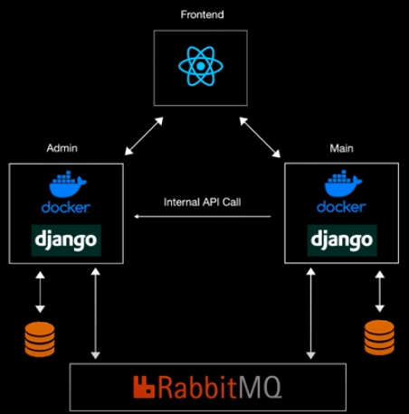

<h1 align="center">Gallery-Microservice</h1>
<p align="center">
  
</p>
<p><br></p>
A Simple Gallery app implemented with microservice architecture.

### Overview
- [Features](#features)
- [Getting ready](#getting-ready)
- [Bugs or Opinion](#bugs-or-opinion)

### Features
- MicroService
- Class Based
- Broker(RabbitMQ)
- REACT
- linting tools
- Dockerize

### Getting ready
To run backend server; change directory to `Backend` then run following command.
```bash
docker compose up --build
```

### Bugs or Opinion
Feel free to let me know if there are any problems or any request you have for this repo.
